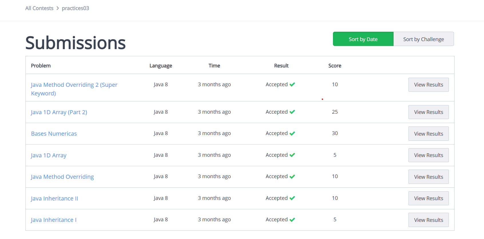

# Practica 03  (HackerRank)

## Objetivo
 
El objetivo de esta práctica fue el poder repasar y practicar algunos temas que vendrían en el primer examen parcial, nuevamente con la realización de ejercicios en la plataforma de HackerRank.

## Descripción

## ⚙️ Tecnologías utilizadas

* **Lenguaje:** Java 8.
* **Plataforma de Evaluación:** HackerRank.

## 📸 Evidencias (Capturas de pantalla)
[**Nota:** Estas imágenes fueron subidas a la raíz del repositorio, así como también la carpeta src con los 7 ejercicios de Hacker Rank.]

### Resultados de Submissions

* **Envíos Aceptados (Java Inheritance I, Java Inheritance II,Bases Numericas, etc.):**
   

  
## 📁 Soluciones (Archivos .java)

El código fuente de los 16 problemas está organizado por paquetes y se puede revisar directamente en la carpeta [src/](https://github.com/valeriagh-star/Practica-01-HackerRank/tree/main/src/).

| Problema de HackerRank | Ruta del Archivo .java | Estado |
| :--- | :--- | :--- |
| **Welcome to Java!** | [src/WelcomeToJava/Solution.java](https://github.com/valeriagh-star/Practica-01-HackerRank/blob/main/src/WelcomeToJava/Solution.java) | Accepted |
| **Java Stdin and Stdout I** | [src/javaStdinAndStdoutI/Solution.java](https://github.com/valeriagh-star/Practica-01-HackerRank/blob/main/src/javaStdinAndStdoutI/Solution.java) | Accepted |
| **Java Stdin and Stdout II** | [src/javaStdinAndStdoutII/Solution.java](https://github.com/valeriagh-star/Practica-01-HackerRank/blob/main/src/javaStdinAndStdoutII/Solution.java) | Accepted |
| **Welcome to Java!** | [src/WelcomeToJava/Solution.java](https://github.com/valeriagh-star/Practica-01-HackerRank/blob/main/src/WelcomeToJava/Solution.java) | Accepted |
| **Java Stdin and Stdout I** | [src/javaStdinAndStdoutI/Solution.java](https://github.com/valeriagh-star/Practica-01-HackerRank/blob/main/src/javaStdinAndStdoutI/Solution.java) | Accepted |
| **Java Stdin and Stdout II** | [src/javaStdinAndStdoutII/Solution.java](https://github.com/valeriagh-star/Practica-01-HackerRank/blob/main/src/javaStdinAndStdoutII/Solution.java) | Accepted |
| **Welcome to Java!** | [src/WelcomeToJava/Solution.java](https://github.com/valeriagh-star/Practica-01-HackerRank/blob/main/src/WelcomeToJava/Solution.java) | Accepted |

## ▶️ Instrucciones de ejecución

Dado que esta práctica consiste en soluciones enviadas a una plataforma en línea, la ejecución es directa:
1.  **Clonar el repositorio.**
2.  **Revisar el Código:** El código fuente de cada problema (`.java`) está incluido. Puedes abrir y revisar las soluciones en cualquier IDE de Java (como IntelliJ o Eclipse).
3.  **Ejecutar (Opcional):** Para probar una solución localmente, copia la clase principal (`class Solution`) a tu IDE y ejecuta el método `main()`, proporcionando la entrada de datos por la consola.
4.  
